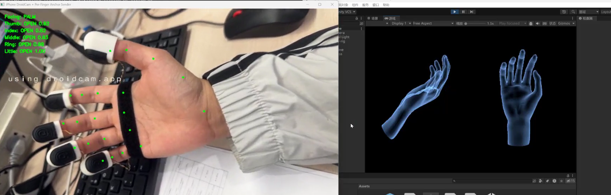

# Vision-Aided IMU Gesture Glove

This project is a real-time gesture-glove upper-computer prototype that fuses wearable IMU/tactile sensing with camera-based hand tracking. It was built to reduce long-term IMU drift in a Unity virtual hand by using MediaPipe Hand as a visual anchor only at reliable gesture states.



## Highlights

- Real-time Unity virtual hand driven by a sensor glove.
- Serial IMU and force/tactile input parsing for finger motion visualization.
- MediaPipe Hand visual correction over UDP.
- Per-finger open/fist calibration database with up to 100 samples per state.
- Palm-facing, back-facing, and side-facing orientation gating.
- Open-palm refresh module for resetting IMU drift only when the palm is facing the camera.
- Per-finger visual hold watchdog that prevents short IDLE spikes from cancelling correction.
- Unity diagnostic logging for UDP receive, JSON parse, filtering, takeover, apply result, and cancellation analysis.

## System Architecture

```text
Sensor glove
  -> STM32 / serial IMU + tactile packets
  -> Unity SerialReceiver
  -> HandMotionManager + FingerSolver
  -> virtual hand pose

iPhone / webcam video
  -> Python MediaPipe Hand
  -> per-finger open/fist and hand-orientation classifier
  -> UDP packets
  -> Unity VisionFingerCorrectionReceiver
  -> visual anchor correction and diagnostic logs
```

## Repository Layout

```text
unity/
  Assets/             Unity scenes, scripts, models, materials
  Packages/           Unity package manifest
  ProjectSettings/    Unity project settings

python/
  mediapipe_udp_sender.py          MediaPipe recognition and UDP sender
  run_mediapipe_udp_sender.bat     Windows launcher
  finger_calibration_db.example.json

docs/images/
  system-demo.png     Screenshot of the camera recognition and Unity hand
```

## Core Unity Scripts

- `HandMotionManager.cs`: maps IMU quaternions into Unity hand and finger rotations.
- `FingerSolver.cs`: solves finger bend/spread and applies force-grid visualization.
- `SerialReceiver.cs`: receives hardware serial packets.
- `VisionFingerCorrectionReceiver.cs`: receives MediaPipe UDP packets and applies per-finger visual anchors.
- `VisionOpenPalmRefreshModule.cs`: recalibrates the IMU baseline on a reliable palm-facing open-hand gesture.

## Python Vision Pipeline

The Python sender performs:

- MediaPipe Hand landmark detection.
- Per-finger distance scoring normalized by each finger's own bone chain length.
- Calibration sample database loading/saving.
- Palm/back/side orientation classification.
- Safety gating:
  - palm facing: allow open/fist and open-palm refresh;
  - back facing: allow open correction only;
  - side facing: do not intervene, Unity/IMU remains in control.
- UDP packet streaming to Unity port `5055`.

The MediaPipe model file is not committed. The script downloads `hand_landmarker.task` automatically when missing.

## Setup

### Unity

1. Install Unity `2022.3 LTS`.
2. Open the `unity/` folder as a Unity project.
3. Open `Assets/Scenes/SampleScene.unity`.
4. Connect the glove serial device and configure the serial port in `SerialReceiver`.
5. Enter Play Mode.

### Python

Create a virtual environment and install dependencies:

```powershell
cd python
python -m venv .venv
.\.venv\Scripts\activate
pip install -r requirements.txt
python mediapipe_udp_sender.py
```

If `python` is not available on Windows, install Python from python.org and disable the Microsoft Store execution alias if necessary.

## Diagnostic Logging

Unity writes a diagnostic log named:

```text
vision_finger_diagnostic.log
```

Typical stages:

- `UDP_RECV`: Unity received a UDP packet.
- `PARSE_OK`: JSON parsed successfully.
- `FILTER_REJECT`: packet rejected by confidence or validation.
- `COOLDOWN_REJECT`: packet blocked by command cooldown.
- `TAKEOVER_START`: visual correction started.
- `IDLE_IGNORED_BY_HOLD`: a short IDLE spike was ignored during per-finger visual hold.
- `APPLY_RESULT`: Unity attempted to apply the visual anchor.
- `TAKEOVER_FINISH`: visual correction completed.
- `CANCEL`: correction was cancelled by timeout or IDLE outside the hold window.

## Project Status

The current prototype demonstrates stable open-palm reset, full-fist correction, per-finger recognition, and diagnostic tracing for debugging visual/IMU fusion conflicts. Future work includes adding depth-camera based wrist translation, improving thumb-specific recognition, and evaluating gesture accuracy over longer data-collection sessions.

